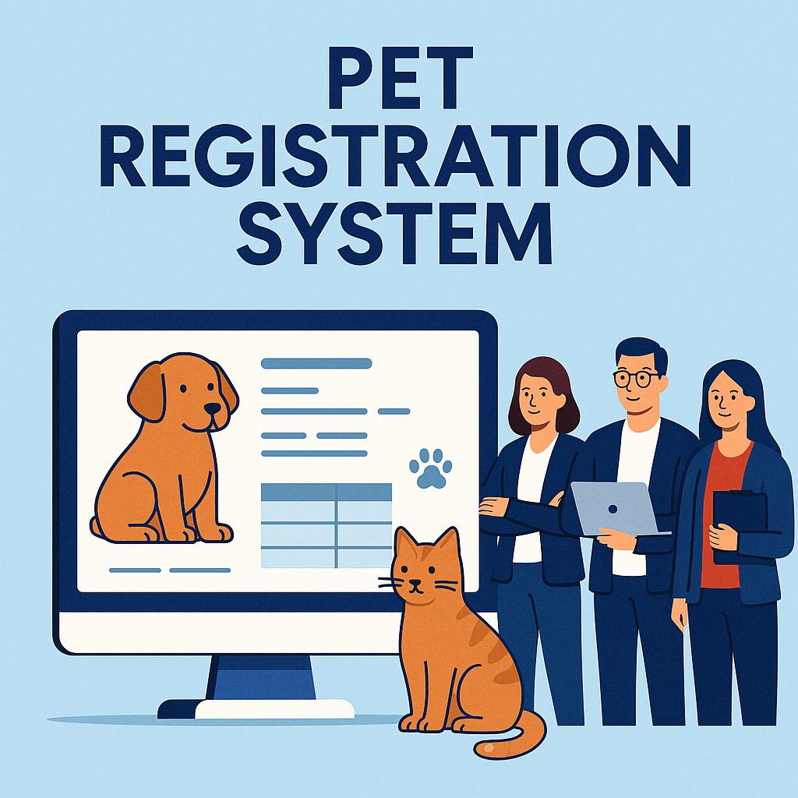

# Sistema de Gerenciamento de Pets para Clínicas



Este é um sistema simples criado para clínicas veterinárias que precisam manter os dados de seus clientes e animais organizados. A proposta é facilitar o dia a dia do atendimento com uma ferramenta prática.

---

## Sobre o Sistema

O projeto foi desenvolvido usando o framework Laravel. Com ele, é possível cadastrar informações dos donos dos animais, registrar dados dos pets e controlar os atendimentos feitos pela clínica.

---

## Funcionalidades Disponíveis

- Cadastro de clientes (nome, telefone, e-mail, CPF, endereço, etc.)  
- Cadastro de pets (nome, idade, espécie, raça, peso, etc.)  
- Registro de atendimentos (data, serviço realizado, observações)  
- Associação entre clientes e seus animais  
- Histórico completo de atendimentos realizados

---

## Como Instalar

Antes de tudo, é importante ter as ferramentas abaixo instaladas no seu computador:

- PHP 8.4 ou superior  
- Docker  
- Composer  
- Laravel Sail

### Etapas de Instalação

1. Clone o repositório do projeto:

```bash
git clone https://github.com/ilyvitorialuz/back-end.git
cd back-end
```

2. Inicie o ambiente com o Sail:

```bash
./vendor/bin/sail up -d
```

3. Configure o arquivo `.env` com as informações do banco de dados:

```env
DB_CONNECTION=mysql
DB_HOST=127.0.0.1
DB_PORT=3306
DB_DATABASE=clinica_pets
DB_USERNAME=root
DB_PASSWORD=
```

4. Rode as migrations para criar as tabelas no banco:

```bash
./vendor/bin/sail artisan migrate
```

5. (Opcional) Adicione dados de exemplo no banco:

```bash
./vendor/bin/sail artisan db:seed
```

6. Acesse o sistema no navegador:

```
http://localhost
```

---

## Agradecimentos

Este sistema foi inspirado nas necessidades reais de clínicas veterinárias. Agradeço a todos que contribuíram com ideias e também à comunidade Laravel, por toda a documentação e ferramentas.

---

## Equipe

Caso tenha dúvidas ou sugestões, entre em contato com os integrantes do projeto:

- Responsável pelo projeto: Emanuel Araújo Alves
- Desenvolvedor Back-End: Geovana Ester Campos
- Desenvolvedora Front-End: Ana Clara Leite